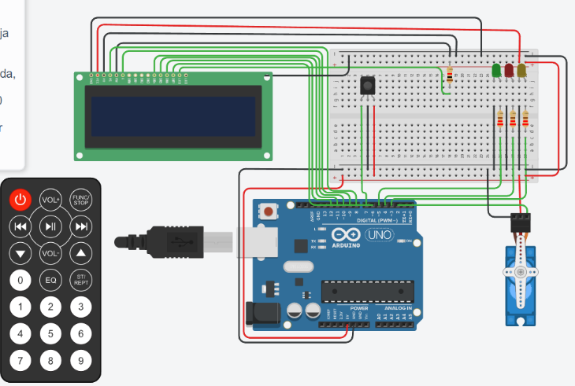

# arduino-circuit
Academic project that attempts to simulate the behaviour of an automatic control system implemented in C++ for arduino.

## INTRODUCTION
The present work tries to simulate the behaviour of an automatic control system implemented using the tinkercad platform with the C++ language. More precisely a control of lights and servomotor by control that reacts according to the buttons that are pressed on it. The characteristics of the developed work are detailed below.

## OBJECTIVES
- To learn the concepts related to circuit programming.
- To understand and apply how to connect the different pins of an arduino board.
- To understand in which situations the different components that can be connected to an arduino board can be used.
- Implement what has been learnt at code level.

## DESCRIPTION OF THE CIRCUIT
An image of the circuit implemented in the virtual simulation environment is left as an illustration in order to understand the subsequent explanation.

### General operation:
When starting the simulation, it is necessary to press the ON/OFF button on the IR control for the first time to activate the system. If this button is not pressed, the system will remain inactive, so it will not respond to any other button on the control, nor will it activate the lights, the LCD or the servomotor. Once switched on, the green and yellow LEDs light up, the servomotor remains at 0°, and the LCD displays the message ‘Sistema: ON’, followed by ‘Bienvenido’ and, finally, a list of available actions: ‘1- serv a 90° 2- serv a 180°’.
With the system on, two main actions are enabled:
acción1(): This action is activated by pressing button 1 on the IR control. When this is done, the red and yellow LEDs light up, the servomotor rotates through 90° and remains in this position until another button on the control is pressed. In addition, the LCD displays the message ‘servo a 90°’.
acción2(): This action is triggered by pressing button 2 on the IR control. In this case, the red LED lights up, the servo motor rotates through 180° and remains in this position until another button on the IR control is pressed. The LCD displays the message ‘LED rojo encendido’ and ‘servo a 180°’.
To switch off the system, the ON/OFF button must be pressed again. When doing so, the servo motor returns to 0°, the LEDs go off and the LCD displays the message ‘Sistema: OFF’.

if you want to see how it works you can visit the following link to thinckercad:

### Components

The components used are presented in the automatic table generated by tinkercad but not all of them are shown.
The two main components required to implement any kind of system implementable on arduino are: 
- The ‘Arduino Uno R3’ board that has all the data pins that are programmable (for manipulation at code level) and power pins that are essential for the operation of the system. These pins allow both the programming of the digital and analogue inputs and outputs and the connection to external devices.
- The breadboard is used as a base to connect different devices to the Arduino board. It also allows power to be distributed to various devices by connecting the power pin and GND pin of the Arduino board to the positive and negative rows of the breadboard, providing a shared power source for the entire circuit.
- The IR control, this infrared remote control allows user interaction with the system by pressing its buttons. However, in order for the system to detect these signals, an IR Sensor is required, which captures the infrared signals sent from the control. This Control-Sensor assembly allows the system to be configured to respond to specific buttons, such as the ON/OFF button, button 1 and button 2. It also provides the possibility to expand the functions of the system in the future by assigning actions to other buttons.
- The LEDs, 3 different coloured LEDs are used in this system to indicate the status of the system. Each LED requires a resistor to prevent it from burning out due to excessive current. The resistors, of 220 ohm each, are unique to each LED and are identified in the diagram as ResistorGreen, ResistorYellow and ResistorRed.
- The servomotor, this component allows the system to physically react to the user's actions. The servo motor has three connection pins: GND (ground), VCC (power) and the signal pin, which is connected to a data pin on the Arduino board. Through programming, the angle of the servomotor is controlled, representing a response to the actions performed with the IR control.
- Finally we have the LCD which is responsible for displaying the status of the system, for example ‘System ON’, servomotor status, options, etc.. This gives us more reliability that the system is reacting to our interaction in a very rudimentary way but it works. Like the LEDs, the 16x2 LCD display is supported by a small resistor (1 ohm) which prevents it from overheating and burning out. 

## CONCLUSION
Finally we managed to implement everything that was requested but not everything was rosy, we had our problems in the development, we feel that at the code level it was relatively easy but the problem comes in the hardware since not having so much experience in the field we had problems with the pin 13 of the arduino board because it caused that the system did not respond as we expected but with a lot of patience and dedication we managed to solve it. The development of the work we consider that it was very fruitful as it is a field that has too many applications in real life to solve problems that still have no solution or that its solution is very poor and could be improved, especially in the field of medicine for example.
